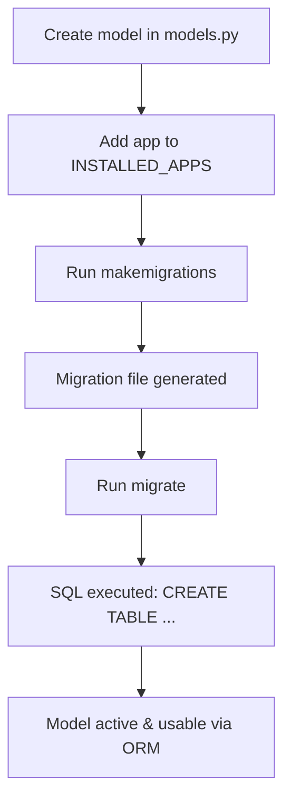

## Activating a Model in Django

### Purpose

"Activating a model" means **making Django recognize it** and **ensuring it’s usable in the database**.
Just creating a class in `models.py` is not enough — you must go through Django’s migration system to **register and apply** it to the database.

---

### Steps to Activate a Model

| Step               | Command / Action                                 | What Happens Internally                                                                                                   |
| ------------------ | ------------------------------------------------ | ------------------------------------------------------------------------------------------------------------------------- |
| **1**              | **Create model in `models.py`**                  | Define a Python class inheriting from `models.Model`                                                                      |
| **2**              | **Add app to `INSTALLED_APPS`** in `settings.py` | Tells Django to load the app and scan for models                                                                          |
| **3**              | `python manage.py makemigrations`                | - Compares current model state with migration history<br>- Creates migration files in `app/migrations/`                   |
| **4**              | `python manage.py migrate`                       | - Reads migration files<br>- Generates SQL<br>- Creates table in DB<br>- Records applied migration in `django_migrations` |
| **5**              | **Use the model**                                | Can now interact via Django ORM (`Model.objects.all()`, `.create()`, etc.)                                                |
| **6** *(optional)* | **Register in admin**                            | Add model to `admin.py` for management in Django Admin                                                                    |

---

### Internal Activation Flow



---

### Minimal Example

**models.py**

```python
from django.db import models

class Book(models.Model):
    title = models.CharField(max_length=100)
    author = models.CharField(max_length=100)

    def __str__(self):
        return self.title
```

**settings.py**

```python
INSTALLED_APPS = [
    'django.contrib.admin',
    'django.contrib.auth',
    # ...
    'myapp',  # Ensure the app containing the model is listed
]
```

**Commands**

```bash
python manage.py makemigrations
python manage.py migrate
```

---

### Admin Activation (Optional)

```python
# admin.py
from django.contrib import admin
from .models import Book

admin.site.register(Book)
```

Now you can **add/edit/delete** books from Django Admin.

---

### Key Points

* Without adding the app to `INSTALLED_APPS`, Django will **ignore** the model.
* Migrations are **mandatory** for activation — no migration means no database table.
* If you delete a model, you must also run `makemigrations` and `migrate` to remove it from the DB.
* You can check activation with:

  ```bash
  python manage.py showmigrations
  python manage.py inspectdb  # to see database tables
  ```

---
