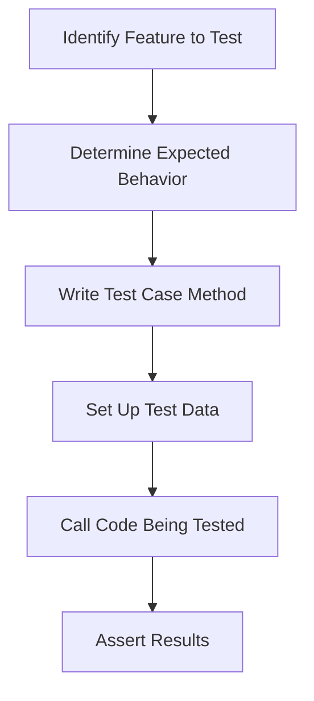

## Designing Test Cases in Django 

### Purpose

Test cases in Django are used to **verify that your application works as expected**.
They help ensure:

* Code correctness
* Prevention of regressions
* Validation of business logic

Django’s testing framework is **built on Python’s `unittest` module** with additional utilities for web app testing.

---

### Types of Tests in Django

| Test Type             | Purpose                                               |
| --------------------- | ----------------------------------------------------- |
| **Unit Tests**        | Test small, isolated parts of code (e.g., a function) |
| **Integration Tests** | Test how multiple components work together            |
| **Functional Tests**  | Simulate user interaction with the app                |
| **Regression Tests**  | Ensure previously fixed bugs do not reappear          |

---

### Django Test Case Structure

**Basic Syntax**

```python
from django.test import TestCase
from .models import Book

class BookModelTest(TestCase):
    def setUp(self):
        # Runs before every test
        Book.objects.create(title="Test Book", author="Author A")

    def test_book_title(self):
        book = Book.objects.get(title="Test Book")
        self.assertEqual(book.title, "Test Book")
```

---

### Test Design Process



---

### Writing Test Cases – Key Points

1. **Import Django’s `TestCase`**
   Inherits from `unittest.TestCase` but sets up a **temporary test database**.

2. **Use `setUp()` Method**
   Prepares test data before each test.

3. **Test Naming**
   Method names should start with `test_` so Django’s test runner can find them.

4. **Assertions**
   Common assertions:

   ```python
   self.assertEqual(a, b)
   self.assertTrue(condition)
   self.assertFalse(condition)
   self.assertContains(response, "text")
   self.assertRedirects(response, "/url/")
   ```

5. **Client for Request Simulation**

   ```python
   from django.test import Client
   client = Client()
   response = client.get('/some-url/')
   self.assertEqual(response.status_code, 200)
   ```

---

### Running Tests

```bash
python manage.py test
```

* Automatically finds tests in files named `test*.py`
* Creates a **temporary database**
* Runs all tests and reports results

---

### Best Practices

* **Test each feature separately**
* Keep tests **independent** (don’t rely on other tests’ data)
* Use **fixtures** or **`setUpTestData`** for reusable data
* Test **edge cases** and **error handling**
* Automate test runs with **CI/CD pipelines**

---

### Example – View Test

```python
from django.test import TestCase
from django.urls import reverse

class HomeViewTest(TestCase):
    def test_home_status_code(self):
        response = self.client.get(reverse('home'))
        self.assertEqual(response.status_code, 200)

    def test_home_template_used(self):
        response = self.client.get(reverse('home'))
        self.assertTemplateUsed(response, 'home.html')
```

---
