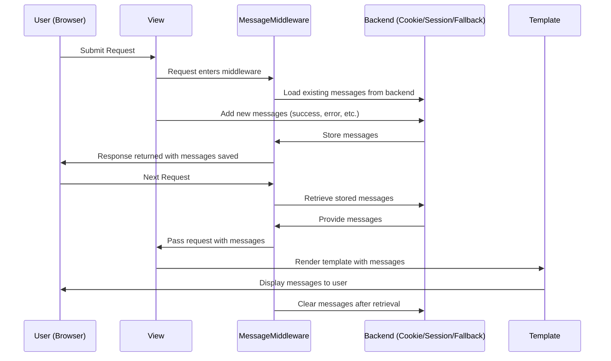

## Django Messaging Framework – Its Working

The Django messaging framework works as a **request–response lifecycle system** that allows messages to be stored temporarily and displayed to the user in the following request.

---

### Core Workflow

#### 1. Middleware Setup

* `MessageMiddleware` integrates the messaging system into the Django request–response cycle.
* On **incoming requests**, it attaches a message storage object to `request._messages`.
* On **outgoing responses**, it ensures messages are stored in the configured backend.

---

#### 2. Message Creation

* Views use `django.contrib.messages` API (`debug`, `info`, `success`, `warning`, `error`) to create messages.
* Each message includes:

  * **Level** (priority: DEBUG → ERROR).
  * **Text** (the actual message).
  * **Tags** (used in templates for styling).

---

#### 3. Storage in Backend

* `MESSAGE_STORAGE` setting defines backend.
* Backends determine how messages persist across requests:

  * **CookieStorage** → Stores in cookies (limited size).
  * **SessionStorage** → Stores in session data (requires session framework).
  * **FallbackStorage** → Tries cookies first, then session (default).

---

#### 4. Request End (Response Phase)

* Before sending the response, middleware writes messages to the chosen backend.
* Messages are **serialized** and stored (either in cookies or sessions).

---

#### 5. Next Request (Retrieval Phase)

* On the next HTTP request, middleware **loads messages** from the backend.
* Messages become available in `request._messages`.
* Django template context processor (`context_processors.messages`) makes them accessible via the `messages` variable.

---

#### 6. Template Rendering

* Messages are retrieved in the template using ``.
* Each message’s `tags` help assign CSS classes (e.g., Bootstrap `alert-success`, `alert-danger`).

---

#### 7. Clearing Messages

* Once messages are **iterated/rendered**, they are **marked as consumed**.
* After retrieval, backends clear them automatically to maintain **one-time delivery** behavior.

---

### Key Properties of the System

* **Ephemeral** – Messages live for exactly one cycle (request → next request → display).
* **Decoupled** – Works independently of views, models, or templates.
* **Middleware-driven** – Relies on `MessageMiddleware` to inject and persist messages.
* **Flexible** – Developers can add custom storage backends and message levels.

---

### High-Level Lifecycle (Working)

1. **View adds a message** → `messages.success(request, "Saved!")`.
2. **MessageMiddleware stores it** in backend during response.
3. **Next request loads messages** from backend.
4. **Template renders messages** to the user.
5. **Messages are cleared** automatically after rendering.

---
