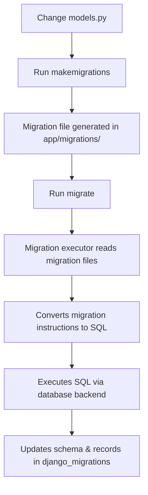

## Working of Migration in Django

### Concept

Migration is Django’s way of **applying model changes to the database** by converting Python model definitions into database schema changes.

It works as a **three-step process**:

1. **Detect changes** in models
2. **Generate migration files** (Python instructions)
3. **Execute SQL** to update the database schema

---

### Internal Workflow



---

### Step-by-Step Execution

| Step  | Action                            | What Happens Internally                                                                                                                         |
| ----- | --------------------------------- | ----------------------------------------------------------------------------------------------------------------------------------------------- |
| **1** | Modify `models.py`                | Developer changes model fields, relationships, or options                                                                                       |
| **2** | `python manage.py makemigrations` | - Django compares current model state with migration history in `django_migrations` table<br>- Creates new migration files in `app/migrations/` |
| **3** | Migration File                    | Contains Python code using `migrations.RunSQL` or `migrations.CreateModel`, etc., with **forward** and **reverse** operations                   |
| **4** | `python manage.py migrate`        | - Django reads unapplied migrations from migration files<br>- Applies them in dependency order                                                  |
| **5** | SQL Generation                    | - ORM generates SQL for each migration<br>- SQL is run via the database backend                                                                 |
| **6** | Tracking                          | Applied migrations are stored in the `django_migrations` table so they aren’t run again                                                         |

---

### Migration File Structure

```python
# Example migration file
from django.db import migrations, models

class Migration(migrations.Migration):
    dependencies = [
        ('app_name', '0001_initial'),
    ]
    operations = [
        migrations.AddField(
            model_name='book',
            name='isbn',
            field=models.CharField(max_length=13, default=''),
        ),
    ]
```

* **dependencies** → Which migrations must be applied first
* **operations** → What changes to make (AddField, AlterField, CreateModel, DeleteModel, RunSQL)

---

### How Django Tracks Migrations

* Table: `django_migrations`
* Stores:

  * `app` → App name
  * `name` → Migration file name
  * `applied` → Timestamp when applied

This prevents reapplying already applied migrations.

---

### Types of Migrations

| Type               | Purpose                               |
| ------------------ | ------------------------------------- |
| Schema migration   | Changes table/column definitions      |
| Data migration     | Modifies data without altering schema |
| Initial migration  | Creates tables for new apps           |
| Squashed migration | Combines multiple migrations into one |

---

### Best Practices for Migration Management

* Always **commit migration files** to version control
* Run migrations before deploying code changes to production
* For large changes, **split into multiple migrations** to avoid downtime
* Use **data migrations** for populating default values
* Use `--fake` only for marking migrations as applied without running SQL

---
