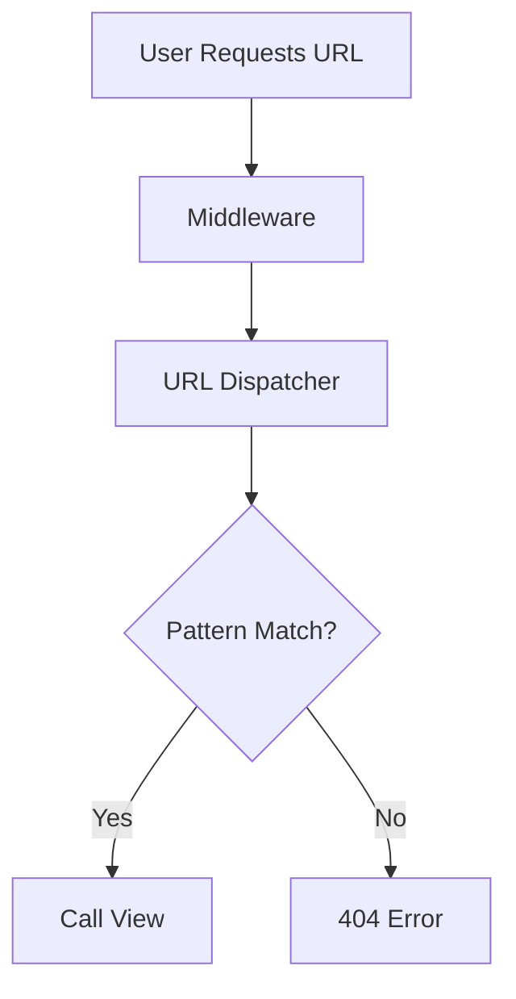

## Routing in Django

---

### Purpose

Routing connects a URL pattern to a specific view. Django uses `urls.py` to define these mappings.

---

### `urls.py` Structure

```python
# project/urls.py or app/urls.py
from django.urls import path, include
from . import views

urlpatterns = [
    path('', views.home, name='home'),
    path('about/', views.about, name='about'),
]
```

---

### `path()` Function Syntax

```python
path(route, view, kwargs=None, name=None)
```

| Parameter | Purpose                                          |
| --------- | ------------------------------------------------ |
| `route`   | URL pattern as a string (can include converters) |
| `view`    | Function or class-based view                     |
| `kwargs`  | Extra arguments passed to the view               |
| `name`    | Named route for reverse URL lookup               |

---

### Dynamic URLs (Path Converters)

```python
path('article/<int:id>/', views.article_detail)
```

| Converter | Type                                        |
| --------- | ------------------------------------------- |
| `str`     | Non-empty string (default)                  |
| `int`     | Integer value                               |
| `slug`    | Slug string (`a-z`, `A-Z`, `0-9`, `-`, `_`) |
| `uuid`    | UUID                                        |
| `path`    | Like `str` but includes `/`                 |

---

### Using Class-Based Views in `urls.py`

```python
from django.views.generic import TemplateView

urlpatterns = [
    path('about/', TemplateView.as_view(template_name='about.html')),
]
```

---

### Including App URLs in Project

```python
# project/urls.py
from django.urls import include

urlpatterns = [
    path('blog/', include('blog.urls')),
]
```

```python
# blog/urls.py
urlpatterns = [
    path('', views.index),
    path('<int:post_id>/', views.detail),
]
```

---

### URL Namespacing

Used to avoid conflicts when multiple apps use the same route names.

```python
# blog/urls.py
app_name = 'blog'
urlpatterns = [
    path('post/<int:id>/', views.post, name='post-detail'),
]

# usage in templates or views:
reverse('blog:post-detail', kwargs={'id': 1})
```

---

### `re_path()` – Regex URLs (Legacy)

```python
from django.urls import re_path

urlpatterns = [
    re_path(r'^page/(?P<slug>[\w-]+)/$', views.page_detail),
]
```

> Prefer `path()` unless regex is necessary.

---

### Reverse URL Lookup

| Method      | Usage                          |
| ----------- | ------------------------------ |
| `reverse()` | In views to get URL from name  |
| `` | In templates to generate links |

```python
from django.urls import reverse
reverse('blog:post-detail', kwargs={'id': 3})
```

```django
<a href="">Read</a>
```

---

### Middleware and URL Resolution

Routing occurs **after** middleware runs. Django checks `urlpatterns` to resolve the view for an incoming request.

---

### Mermaid Diagram for Routing Flow



---
