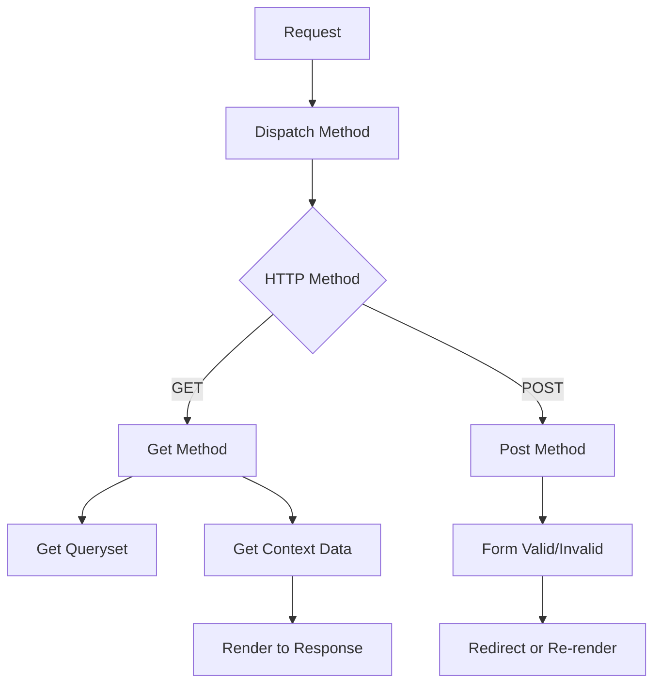

### **Detailed Notes on Django's Generic Class-Based Views (CBVs)**

Generic CBVs are prebuilt class-based views in Django designed to handle common web development tasks, such as rendering templates, managing forms, and performing CRUD operations. These views follow an object-oriented approach and significantly reduce boilerplate code.

---

### **Types of Generic CBVs**
Django provides several generic CBVs, grouped into the following categories:

| **Type**           | **Description**                                                                                 | **Base Class** |
|---------------------|-------------------------------------------------------------------------------------------------|----------------|
| **Display Views**   | Used to render templates and display data.                                                     | `View`         |
| **Editing Views**   | Used to handle form submissions for creating, updating, or deleting objects.                   | `View`         |
| **Date Views**      | Used to work with date-based data (e.g., archives).                                             | `View`         |

#### **Display Views**
- **`TemplateView`**
  - Renders a specified template with context data.
  - Use for static pages like "About Us."
  - **Key Attributes/Methods:**
    - `template_name`: Template to render.
    - `get_context_data`: Add context data.

- **`ListView`**
  - Displays a list of objects from a queryset.
  - **Key Attributes/Methods:**
    - `model`: Model to query.
    - `queryset`: Override default queryset.
    - `context_object_name`: Context variable name for the list.
    - `paginate_by`: Number of objects per page.

- **`DetailView`**
  - Displays a single object based on its primary key or slug.
  - **Key Attributes/Methods:**
    - `model`: Model to query.
    - `get_object`: Fetch the object.
    - `context_object_name`: Context variable for the object.

#### **Editing Views**
- **`FormView`**
  - Handles forms not tied to models.
  - **Key Attributes/Methods:**
    - `form_class`: Form class to use.
    - `initial`: Initial data for the form.
    - `success_url`: URL to redirect to after successful submission.

- **`CreateView`**
  - Handles object creation using a model form.
  - **Key Attributes/Methods:**
    - Inherits from `FormView`.
    - `fields`: Fields to include in the form.
    - `model`: Model for the form.
    - `get_success_url`: Redirect after success.

- **`UpdateView`**
  - Updates an existing object using a model form.
  - Similar to `CreateView` but includes `get_object` to fetch the object.

- **`DeleteView`**
  - Deletes an object and redirects to a specified URL.
  - **Key Attributes/Methods:**
    - `model`: Model to delete.
    - `get_object`: Fetch the object.
    - `success_url`: URL after deletion.

#### **Date Views**
- **`ArchiveView`, `YearArchiveView`, `MonthArchiveView`, etc.**
  - Handle date-based filtering of objects.
  - **Key Attributes/Methods:**
    - `date_field`: Model field for dates.
    - `allow_empty`: Whether empty lists are allowed.

---

### **Key Attributes of Generic CBVs**
Generic CBVs use attributes to configure their behavior.

| **Attribute**           | **Description**                                                                                   |
|--------------------------|---------------------------------------------------------------------------------------------------|
| `template_name`          | Specifies the template to render.                                                                |
| `model`                  | Specifies the model for the view.                                                                |
| `queryset`               | Overrides the default queryset for fetching data.                                                |
| `context_object_name`    | Customizes the context variable name for the template.                                           |
| `success_url`            | Specifies the URL to redirect to after a successful operation.                                   |
| `fields`                 | Defines model fields to include in forms (for `CreateView` and `UpdateView`).                    |
| `paginate_by`            | Enables pagination in `ListView`.                                                               |
| `date_field`             | Specifies the date field for `DateView` and related views.                                       |

---

### **Key Methods in Generic CBVs**
These methods can be overridden to customize the behavior of generic CBVs.

| **Method**                 | **Purpose**                                                                                   |
|----------------------------|-----------------------------------------------------------------------------------------------|
| `get_queryset()`           | Returns the queryset used by the view.                                                       |
| `get_context_data(**kwargs)` | Adds custom context data for rendering templates.                                            |
| `get_object()`             | Fetches a single object for views like `DetailView`, `UpdateView`, and `DeleteView`.          |
| `form_valid(form)`         | Handles successful form submission.                                                          |
| `form_invalid(form)`       | Handles invalid form submission.                                                             |
| `get_success_url()`        | Dynamically sets the URL to redirect after success.                                           |
| `get_template_names()`     | Dynamically determines the template(s) to render.                                             |

---

### **Mixins Used with Generic CBVs**
Mixins add specific behavior to CBVs by extending functionality.

| **Mixin**                   | **Purpose**                                                                                  |
|-----------------------------|-----------------------------------------------------------------------------------------------|
| `LoginRequiredMixin`        | Restricts access to authenticated users only.                                                |
| `PermissionRequiredMixin`   | Requires specific permissions to access the view.                                            |
| `UserPassesTestMixin`       | Custom user-based access control.                                                            |
| `ContextMixin`              | Adds context data for rendering templates.                                                   |
| `FormMixin`                 | Adds form-handling capabilities.                                                             |
| `SingleObjectMixin`         | Fetches a single object for `DetailView`, `UpdateView`, and `DeleteView`.                    |
| `MultipleObjectMixin`       | Handles multiple objects for `ListView`.                                                     |

---

### **Examples**
#### **1 TemplateView**
```python
from django.views.generic import TemplateView

class AboutView(TemplateView):
    template_name = "about.html"

    def get_context_data(self, **kwargs):
        context = super().get_context_data(**kwargs)
        context['title'] = "About Us"
        return context
```

#### **2 ListView**
```python
from django.views.generic import ListView
from myapp.models import Book

class BookListView(ListView):
    model = Book
    template_name = "book_list.html"
    context_object_name = "books"
    paginate_by = 10
```

#### **3 CreateView**
```python
from django.views.generic.edit import CreateView
from myapp.models import Book

class BookCreateView(CreateView):
    model = Book
    fields = ['title', 'author', 'isbn']
    template_name = "book_form.html"
    success_url = "/books/"
```

#### **4 DeleteView**
```python
from django.views.generic.edit import DeleteView
from myapp.models import Book

class BookDeleteView(DeleteView):
    model = Book
    success_url = "/books/"
```

---

### **Best Practices**
1. **Leverage Inheritance:**
   - Reuse existing CBVs to avoid boilerplate code.

2. **Override Methods Sparingly:**
   - Customize only the necessary methods (e.g., `get_context_data`, `form_valid`).

3. **Use Mixins:**
   - Combine multiple mixins to modularize and extend functionality.

4. **Optimize Querysets:**
   - Always filter or optimize the queryset in `get_queryset`.

5. **Follow Naming Conventions:**
   - Use meaningful names for `context_object_name` and `template_name`.

---

### **Generic CBV Workflow**
Mermaid diagram showing the typical workflow:



---
