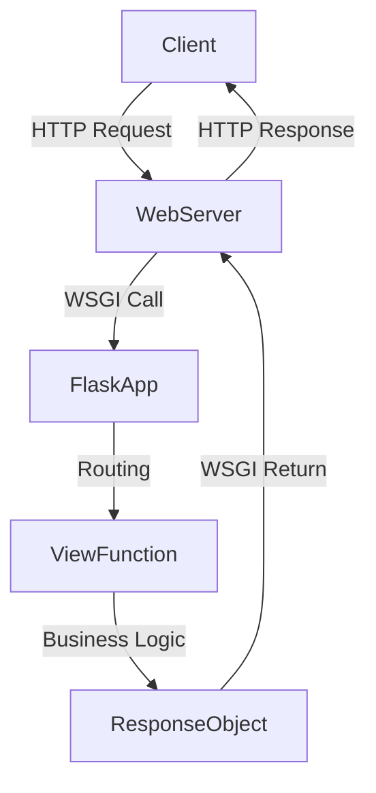

# 🧩 Overview of Flask Framework

### 🔹 What is Flask?
Flask is a **lightweight and modular web framework** for Python based on **Werkzeug (WSGI toolkit)** and **Jinja2 (templating engine)**. It provides the core tools to build web applications but leaves flexibility to add components via extensions.

---

## 🧠 Design Philosophy

| Principle               | Description                                                                 |
|------------------------|-----------------------------------------------------------------------------|
| **Simplicity**         | Minimalistic core with sensible defaults; "micro" does not mean lacking features. |
| **Flexibility**        | No forced directory structure or project layout; freedom of architecture.   |
| **Extensibility**      | Rich extension ecosystem for ORM, auth, forms, REST APIs, etc.              |
| **Explicitness**       | Clear routing, explicit template rendering, and session management.         |
| **WSGI Compliant**     | Built on WSGI, interoperable with other Python web tools.                   |

---

## 🧱 Core Architecture

| Layer                  | Component Description                                                                 |
|------------------------|----------------------------------------------------------------------------------------|
| **WSGI Server**        | Hosts the app (e.g., Gunicorn, uWSGI).                                                 |
| **Werkzeug**           | Underlying WSGI utility library used by Flask for request/response handling.           |
| **Flask App Layer**    | Handles routing, request context, view dispatching, and response generation.           |
| **Jinja2**             | Templating engine for HTML rendering.                                                  |
| **Extensions**         | Optional plug-ins (e.g., Flask-SQLAlchemy, Flask-Login, Flask-WTF).                    |

---

## 🧩 Core Components

| Component         | Role                                                                                 |
|-------------------|----------------------------------------------------------------------------------------|
| **Flask Class**    | Entry point of app (`app = Flask(__name__)`).                                         |
| **Routing**        | Maps URLs to Python functions using `@app.route`.                                     |
| **Request/Response**| Handles HTTP requests (`request`) and generates responses (`make_response`, `jsonify`). |
| **Templates**      | Uses Jinja2 to render dynamic HTML (`render_template`).                               |
| **Session**        | Secure cookie-based session support (`session` object).                               |
| **Static Files**   | Serves static content like JS, CSS, images via `/static/`.                            |
| **Configuration**  | Uses `app.config` dictionary for app-wide settings.                                   |
| **Error Handling** | Custom error views using `@app.errorhandler`.                                         |
| **Blueprints**     | Allows modular design of app parts (e.g., `auth`, `blog`).                            |

---

## ⚙️ Key Lifecycle Flow

---

## 🔧 Built-in Features

- Development server & debugger
- RESTful request handling
- Secure sessions via cookies
- Integrated unit test support
- CLI for running and managing apps
- Built-in support for JSON
- Modular views with blueprints

---

## 🧱 Common Extensions

| Extension         | Functionality                                        |
|------------------|------------------------------------------------------|
| Flask-SQLAlchemy | ORM and database integration                         |
| Flask-WTF        | Form handling with validation                        |
| Flask-Login       | User session and authentication                     |
| Flask-Migrate     | Database migrations with Alembic                    |
| Flask-Mail        | Email sending                                       |
| Flask-RESTful     | Simplified REST API creation                        |
| Flask-Caching     | Add caching support                                 |

---

## 🧪 Testing Support

- `app.test_client()` for simulating requests
- `test_request_context()` for context setup
- Integrated with `unittest` or `pytest`

---

## 🚀 Use Cases

- Microservices
- RESTful APIs
- Prototypes and MVPs
- Admin panels
- Educational projects
- Production apps with proper extension usage

---
